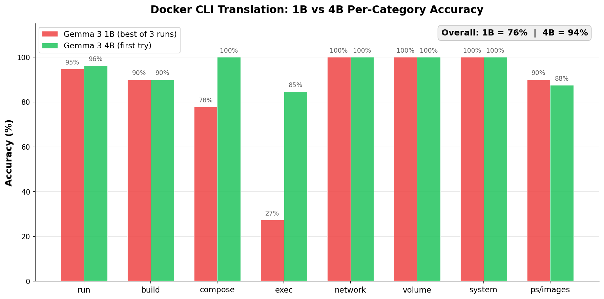

# nlcli-wizard

[](LICENSE)
[](https://www.python.org/downloads/)
[](https://colab.research.google.com/drive/1uBJJ_EqCMT8bMnCnVQHeN8USKu1ABddL?usp=sharing)
[](https://www.reddit.com/r/LocalLLaMA/comments/1or1e7p/i_finetuned_gemma_3_1b_for_cli_command/)

A framework for adding natural language interfaces to CLI tools using locally-trained small language models. No cloud APIs, no subscriptions -- runs offline on CPU.

```bash
# Instead of memorizing flags
docker run -d -p 8080:80 --name web -e NODE_ENV=production nginx

# Just describe what you want
docker -w "run nginx on port 8080 with production env in background"
```

> **📢 Discussion:** See the [Reddit thread](https://www.reddit.com/r/LocalLLaMA/comments/1or1e7p/i_finetuned_gemma_3_1b_for_cli_command/) for technical discussion and community feedback.


## Demo

[https://github.com/user-attachments/assets/VIDEO_ID_HERE](https://github.com/user-attachments/assets/2d7ca418-d6b2-4449-a81e-417df9666d44)

## Results: Docker CLI translation

Trained on 594 Docker command examples across 8 categories (run, build, exec, compose, network, volume, system, ps/images).



| | Gemma 3 1B | Gemma 3 4B |
|--|-----------|-----------|
| Accuracy | 73-76% (ceiling after 3 runs) | **94%** (first try) |
| Model size | 810 MB | ~2.5 GB |
| Inference (CPU) | ~5s | ~12s |
| Training time | 16 min on free Colab T4 | ~45 min on free Colab T4 |
| Trainable params | 13M / 1B (1.29%) | ~50M / 4B (~1.3%) |

The 1B model hits a capacity ceiling at 73-76% -- fixing one command category causes regressions in others (the "whack-a-mole effect"). The 4B model holds all flag patterns simultaneously without trading accuracy between categories. Full analysis in the [Reddit discussion](https://www.reddit.com/r/LocalLLaMA/comments/1or1e7p/i_finetuned_gemma_3_1b_for_cli_command/).

### Per-category breakdown (4B)

| Category | Accuracy | Category | Accuracy |
|----------|----------|----------|----------|
| run | 96.2% | network | 100% |
| build | 90.0% | volume | 100% |
| compose | 100% | system | 100% |
| exec | 84.6% | ps/images | 87.5% |

## Quick start

### Use the pre-trained Docker model

```bash
# Clone and install
git clone https://github.com/pranavkumaarofficial/nlcli-wizard.git
cd nlcli-wizard
pip install -e .

# Download the 4B GGUF model (~2.5GB) and place in models/
# (HuggingFace repo: pranavkumaarofficial/nlcli-gemma3-docker)

# Translate
python -m nlcli_wizard.cli translate --cli-tool docker "run nginx on port 8080 in background"
# Command: docker run -d -p 8080:80 nginx
# Confidence: 95%
# Runs nginx container in detached mode, mapping port 8080 to 80

python -m nlcli_wizard.cli translate --cli-tool docker "stop container web"
# Command: docker stop web
# Confidence: 95%
# Stops web container
```

### Train your own model

[](https://colab.research.google.com/drive/1uBJJ_EqCMT8bMnCnVQHeN8USKu1ABddL?usp=sharing)

The training notebook runs on free Colab T4 with step-by-step explanations. No ML experience required.

```bash
# 1. Generate training data for your CLI tool
python -m nlcli_wizard.dataset_docker  # generates data/docker_training.jsonl

# 2. Open the Colab notebook and train (free T4 GPU)
# 3. Download the GGUF model and place in models/
# 4. Run evaluation
python test/evaluate_docker.py
```

## How it works

```
User: "scale web service to 3 instances"
  |
  v
Prompt: "<start_of_turn>user\nTranslate to docker command: ...<end_of_turn>\n<start_of_turn>model\n"
  |
  v
Gemma 3 4B (fine-tuned, quantized Q4_K_M, running on CPU via llama.cpp)
  |
  v
COMMAND: docker-compose up --scale web=3
CONFIDENCE: 0.92
EXPLANATION: Scales the web service to 3 replicas
  |
  v
Preview -> Confirm -> Execute
```

The model outputs structured `COMMAND / CONFIDENCE / EXPLANATION` format. The agent parses this and asks for confirmation before executing.

## Architecture

The framework is tool-agnostic. To add support for a new CLI tool:

1. Write a dataset generator -- parse `--help` output, generate NL variations for each command
2. Train on Colab -- swap the dataset file, run the notebook
3. Drop in the GGUF -- place the quantized model in `models/`
4. Register in MODEL_REGISTRY -- add an entry in `model.py`

```
nlcli-wizard/
  nlcli_wizard/
    cli.py              # CLI interface
    model.py            # Model loading, MODEL_REGISTRY
    agent.py            # Prompt formatting, output parsing
    dataset.py          # Venvy dataset generator
    dataset_docker.py   # Docker dataset generator (594 examples)
  training/
    nlcli_wizard_training_[PUBLIC].ipynb   # Colab training notebook
  test/
    evaluate_docker.py  # Per-category accuracy evaluation
  data/
    docker_training.jsonl   # Generated training data
  models/
    *.gguf              # Quantized models (gitignored)
  scripts/
    docker-wizard.sh    # Shell wrapper
    docker-wizard.ps1   # PowerShell wrapper
    plot_comparison.py  # Generate comparison charts
```

## Technical stack

- **Base model**: Gemma 3 4B-Instruct (via Unsloth)
- **Training**: QLoRA with Unsloth on free Colab T4
- **Quantization**: GGUF Q4_K_M with importance matrix via llama.cpp
- **Inference**: llama-cpp-python, CPU, 4 threads
- **Output format**: Structured COMMAND/CONFIDENCE/EXPLANATION

## Supported tools

| Tool | Dataset | Model | Accuracy | Status |
|------|---------|-------|----------|--------|
| Docker | 594 examples | Gemma 3 4B | 94% | Available |
| [Venvy](https://github.com/pranavkumaarofficial/venvy) | 1,500 examples | Gemma 3 1B | 83% | Available |
| Kubernetes | -- | -- | -- | Planned |
| Git | -- | -- | -- | Planned |

### Venvy (proof-of-concept)

The first tool integrated was [venvy](https://github.com/pranavkumaarofficial/venvy), a fast Python virtual environment manager:

```
"show my environments sorted by size"  ->  venvy ls --sort size
"register this project as myenv"       ->  venvy register --name myenv
"clean up old venvs"                   ->  venvy cleanup --days 90
```

Trained on Gemma 3 1B with 1,500 verified examples. 83% accuracy. This was the proof-of-concept that validated the architecture before moving to Docker and 4B.

## Roadmap

- [x] Venvy proof-of-concept (Gemma 3 1B, 83% accuracy)
- [x] Docker support (Gemma 3 4B, 94% accuracy)
- [x] 1B vs 4B comparison with per-category analysis
- [x] Training notebook with step-by-step explanations
- [ ] Auto-ingestion pipeline: `--help` docs in, training data out, weights packaged
- [ ] Error correction feedback loop (command fails -> suggest fix)
- [ ] PyPI package release
- [ ] Kubernetes and Git datasets

The end goal: any CLI tool maintainer can point this at their docs, generate training data, fine-tune a model, and ship weights alongside their package. Their users get `tool -w "what I want to do"` for free.

## Contributing

See [CONTRIBUTING.md](CONTRIBUTING.md) for details on:
- Adding new CLI tool support
- Improving dataset quality
- Testing and evaluation

## Community

- [Reddit: r/LocalLLaMA discussion](https://www.reddit.com/r/LocalLLaMA/comments/1or1e7p/i_finetuned_gemma_3_1b_for_cli_command/)
- [GitHub Issues](https://github.com/pranavkumaarofficial/nlcli-wizard/issues)

## License

[MIT License](LICENSE)

## Star History

[](https://www.star-history.com/#pranavkumaarofficial/nlcli-wizard&type=date&legend=top-left)

---

Built by [Pranav Kumaar](https://github.com/pranavkumaarofficial) | [nlcli-wizard](https://github.com/pranavkumaarofficial/nlcli-wizard) | [venvy](https://github.com/pranavkumaarofficial/venvy)
